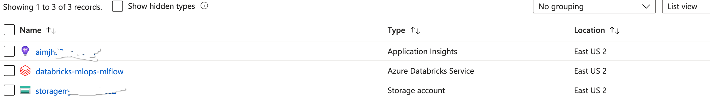
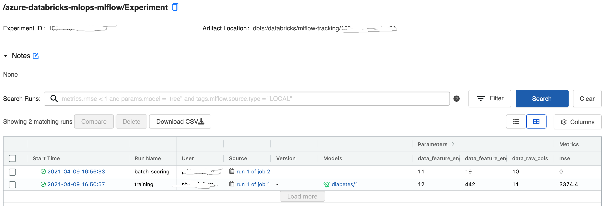
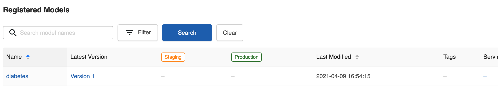

# Azure Databricks MLOps using MLflow

This is a template or sample for [MLOps](https://github.com/microsoft/mlops) for [Python](https://www.python.org) based source code in [Azure Databricks](https://docs.microsoft.com/en-us/azure/databricks/) using [MLflow](https://docs.microsoft.com/en-us/azure/databricks/applications/mlflow/) without using [MLflow Project](https://mlflow.org/docs/latest/projects.html#).

This template provides the following features:

- A way to run Python based MLOps without using [MLflow Project](https://mlflow.org/docs/latest/projects.html#), but still using [MLflow](https://docs.microsoft.com/en-us/azure/databricks/applications/mlflow/) for managing the end-to-end machine learning lifecycle.
- Sample of machine learning source code structure along with Unit Test cases
- Sample of MLOps code structure along with Unit Test cases
- Demo setup to try on users subscription

## Problem Summary

- This demonstrates deployment scenario of [Orchestrate MLOps on Azure Databricks using Databricks Notebook](https://docs.microsoft.com/en-us/azure/architecture/reference-architectures/ai/orchestrate-mlops-azure-databricks)

## Products/Technologies/Languages Used

- Products & Technologies:
  - Azure Databricks
  - Azure Blob Storage
  - Azure Monitor
- Languages:
  - Python

## Architecture

### Model Training


### Batch Scoring


## Individual Components

- [ml_experiment](./ml_experiments/experiment_notebook.ipynb) - sample ML experiment notebook.
- [ml_data](./ml_data/) - dummy data for sample model
- [ml_ops](./ml_ops/) - sample MLOps code along with Unit Test cases, orchestrator, deployment setup.
- [ml_source](./ml_source/) - sample ML code along with Unit Test cases
- [Makefile](./Makefile) - for build, test in local environment
- [requirements.txt](./requirements.txt) - python dependencies

## Getting Started

### Prerequisites

- [Azure Databricks](https://docs.microsoft.com/en-us/azure/databricks/) workspace
- [Azure Data Lake Storage Gen2](https://docs.microsoft.com/en-us/azure/storage/blobs/data-lake-storage-introduction) account
- [Visual Studio Code](https://code.visualstudio.com/) in local environment for development
- [Docker](https://www.docker.com/) in local environment for development

### Development

1. `git clone https://github.com/Azure-Samples/azure-databricks-mlops-mlflow.git`
2. `cd azure-databricks-mlops-mlflow`
3. Open cloned repository in Visual Studio Code [Remote Container](https://code.visualstudio.com/docs/remote/containers)
4. Open a [terminal](https://code.visualstudio.com/docs/remote/containers#_opening-a-terminal) in Remote Container from Visual Studio Code
5. `make install` to install sample packages (`diabetes` and `diabetes_mlops`) locally
6. `make test` to Unit Test the code locally

### Package

1. `make dist` to build wheel Ml and MLOps packages (`diabetes` and `diabetes_mlops`) locally

### Deployment

1. `make databricks-deploy-code` to deploy Databricks Orchestrator Notebooks, ML and MLOps Python wheel packages. If any code changes.
2. `make databricks-deploy-jobs` to deploy Databricks Jobs. If any changes in job specs.

### Run training and batch scoring

1. To trigger training, execute `make run-diabetes-model-training`
2. To trigger batch scoring, execute `make run-diabetes-batch-scoring`

**NOTE:** for [deployment](#deployment) and [running](#run-training-and-batch-scoring) the Databricks environment should be created first, for creating a demo environment the [Demo](#demo) chapter can be followed.

### Observability

Check Logs, create alerts. etc. in [Application Insights](https://docs.microsoft.com/en-us/azure/azure-monitor/app/app-insights-overview). Following are the few sample [Kusto Query](https://docs.microsoft.com/en-us/azure/data-explorer/kusto/query/) to check logs, traces, exception, etc.

- Check for Error, Info, Debug Logs

  Kusto Query for checking general logs for a specific MLflow experiment, filtered by `mlflow_experiment_id`

  ```kusto
    traces
  | extend mlflow_experiment_id = customDimensions.mlflow_experiment_id
  | where timestamp > ago(30m) 
  | where mlflow_experiment_id == <mlflow experiment id>
  | limit 1000
  ```

  Kusto Query for checking general logs for a specific Databricks job execution filtered by `mlflow_experiment_id` and `mlflow_run_id`

  ```kusto
  traces
  | extend mlflow_run_id = customDimensions.mlflow_run_id
  | extend mlflow_experiment_id = customDimensions.mlflow_experiment_id
  | where timestamp > ago(30m) 
  | where mlflow_experiment_id == <mlflow experiment id>
  | where mlflow_run_id == "<mlflow run id>"
  | limit 1000
  ```

- Check for Exceptions

  Kusto Query for checking exception log if any

  ```kusto
  exceptions 
  | where timestamp > ago(30m)
  | limit 1000
  ```

- Check for duration of different stages in MLOps

  Sample Kusto Query for checking duration of different stages in MLOps

  ```kusto
  dependencies 
  | where timestamp > ago(30m) 
  | where cloud_RoleName == 'Diabetes_Training'
  | limit 1000
  ```

To correlate dependencies, exceptions and traces, `operation_Id` can be used a filter to above Kusto Queries.

## Demo

1. Create Databricks workspace, a storage account (Azure Data Lake Storage Gen2) and Application Insights
   1. Create an [Azure Account](https://azure.microsoft.com/en-in/free/)
   2. [Deploy resources](https://docs.microsoft.com/en-us/azure/azure-resource-manager/templates/deploy-portal#deploy-resources-from-custom-template) from [custom ARM template](ml_ops/deployment/arm_templates/databricks_and_storage.json)
2. Initialize Databricks (create cluster, base workspace, mlflow experiment, secret scope)
   1. Get [Databricks CLI](https://docs.microsoft.com/en-us/azure/databricks/dev-tools/cli/) Host and Token
   2. Authenticate Databricks CLI `make databricks-authenticate`
   3. Execute `make databricks-init`
3. Create Azure Data Lake Storage Gen2 Container and upload data
   1. [Create](https://docs.microsoft.com/en-us/azure/storage/blobs/storage-quickstart-blobs-portal#create-a-container) Azure Data Lake Storage Gen2 Container named - `diabetes`
   2. [Upload](https://docs.microsoft.com/en-us/azure/storage/blobs/storage-quickstart-blobs-portal#upload-a-block-blob) as blob [diabetes data files](./ml_data/) into Azure Data Lake Storage Gen2 container named - `diabetes`
4. Put secrets to [Mount ADLS Gen2 Storage using Shared Access Key](https://docs.microsoft.com/en-gb/azure/databricks/data/data-sources/azure/azure-storage)
   1. Get Azure Data Lake Storage Gen2 account name created in step 1
   2. Get [Shared Key](https://docs.microsoft.com/en-us/rest/api/storageservices/authorize-with-shared-key) for Azure Data Lake Storage Gen2 account
   3. Execute `make databricks-secrets-put` to put secret in Databricks secret scope
5. Put Application Insights Key as a secret in Databricks secret scope (optional)
   1. Get [Application Insights Key](https://docs.microsoft.com/en-us/azure/azure-monitor/app/create-new-resource#copy-the-instrumentation-key) created in step 1
   2. Execute `make databricks-add-app-insights-key` to put secret in Databricks secret scope
6. Package and deploy into Databricks (Databricks Jobs, Orchestrator Notebooks, ML and MLOps Python wheel packages)
   1. Execute `make deploy`
7. Run Databricks Jobs
   1. To trigger training, execute `make run-diabetes-model-training`
   2. To trigger batch scoring, execute `make run-diabetes-batch-scoring`
8. Expected results
   1. Azure resources
      
   2. Databricks jobs
      
   3. Databricks mlflow experiment
      
   4. Databricks mlflow model registry
      
   5. Output of batch scoring
      

## Additional Details

1. [Continuous Integration (CI) & Continuous Deployment (CD)](docs/advance/cicd.md)
2. [Registered Models Stages and Transitioning](docs/advance/registered_model_stages.md)

## Related resources

1. [Azure Databricks](https://docs.microsoft.com/en-us/azure/databricks/)
2. [MLflow](https://docs.microsoft.com/en-us/azure/databricks/applications/mlflow/)
3. [MLflow Project](https://mlflow.org/docs/latest/projects.html#)
4. [Run MLflow Projects on Azure Databricks](https://docs.microsoft.com/en-us/azure/databricks/applications/mlflow/projects)
5. [Databricks Widgets](https://docs.microsoft.com/en-us/azure/databricks/dev-tools/databricks-utils#--widget-utilities)
6. [Databricks Notebook-scoped Python libraries](https://docs.microsoft.com/en-us/azure/databricks/libraries/notebooks-python-libraries)
7. [Databricks CLI](https://docs.microsoft.com/en-us/azure/databricks/dev-tools/cli/)
8. [Azure Data Lake Storage Gen2](https://docs.microsoft.com/en-us/azure/storage/blobs/data-lake-storage-introduction)
9. [Application Insights](https://docs.microsoft.com/en-us/azure/azure-monitor/app/app-insights-overview)
10. [Kusto Query Language](https://docs.microsoft.com/en-us/azure/data-explorer/kusto/query/)

## Glossaries

1. [Application developer](https://docs.microsoft.com/en-us/azure/machine-learning/team-data-science-process/overview) : It is a role that work mainly towards operationalize of machine learning.
2. [Data scientist](https://docs.microsoft.com/en-us/azure/machine-learning/team-data-science-process/roles-tasks#structure-of-data-science-groups-and-teams) : It is a role to perform the data science parts of the project

## Contributors

- [Julien Chomarat](https://github.com/jchomarat)  
- [Benjamin Guinebertière](https://github.com/benjguin)  
- [Ankit Sinha](https://github.com/ankitbko)  
- [Prabal Deb](https://github.com/prabdeb)  
- [Megha Patil](https://github.com/meghapatilcode)  
- [Srikantan Sankaran](https://github.com/ssrikantan)   
- [Frédéric Le Coquil](https://github.com/flecoqui)  
- [Anand Chugh](https://github.com/anandchugh)
