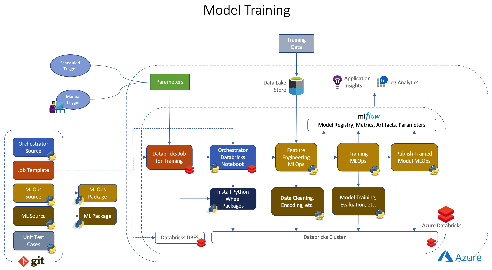
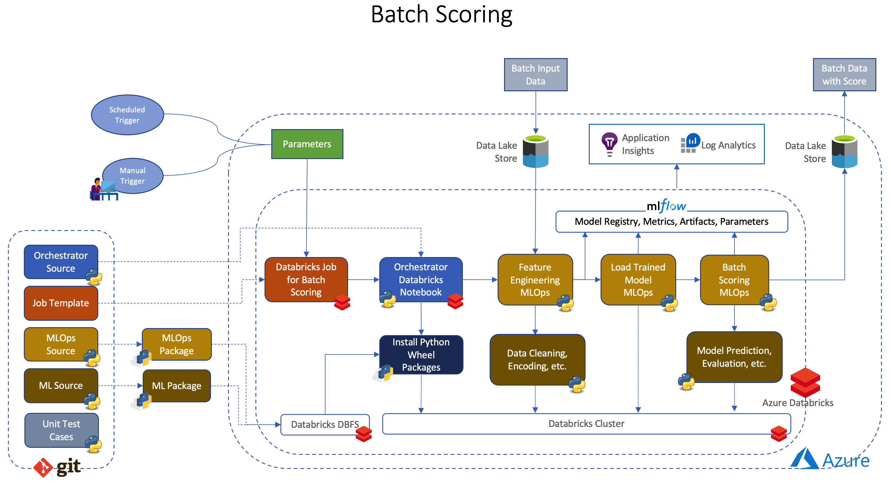

# Azure Databricks MlOps using MLflow

## Overview

This is a template or sample for [MlOps](https://github.com/microsoft/mlops) for [Python](https://www.python.org) based source code in [Azure Databricks](https://docs.microsoft.com/en-us/azure/databricks/) using [MLflow](https://docs.microsoft.com/en-us/azure/databricks/applications/mlflow/) without using [MLflow Project](https://mlflow.org/docs/latest/projects.html#).

## Why not MLflow Project

- [MLflow Project](https://mlflow.org/docs/latest/projects.html#) is a format for packaging data science code in a reusable and reproducible way. It's a perfect fit for several use cases, refer [Run MLflow Projects on Azure Databricks](https://docs.microsoft.com/en-us/azure/databricks/applications/mlflow/projects) for more details.
- However in some scenarios there are challenges with MLflow Project -
  - A new Databricks cluster will be created when running a MLflow Project on Databricks. Running Projects against existing clusters is not supported. This might be a problem in scenarios like -
    - Duration of run will be increased due to creation of cluster each time.
    - Need access to create Databricks cluster when running a MLflow Project, may not be possible is some restricted environments.
  - MLflow Project is invoked via `mlflow run` command, that means a machine (that will execute the `mlflow run` command) is needed which should have access to source code repository and Databricks environments, which may not be possible when Databricks is restricted to run behind VPN.
  - Databricks standard features like [Widgets](https://docs.databricks.com/notebooks/widgets.html), [Notebook-scoped Python libraries](https://docs.databricks.com/libraries/notebooks-python-libraries.html), etc. can not be used in MLflow Project entry point scripts.
  - Hard to integrate to with other Databricks pipelines (example - data processing pipelines).
  - Testability of MLOps code (MLflow Project entry point scripts) -
    - If they are Python scripts, Unit Testing might be hard since they will be outside of a Python package.
    - Since they are not Databricks Notebook, Integration testing might be challenging.

## Features

This template with samples that provides the following features:

- A way to run Python based MlOps without using [MLflow Project](https://mlflow.org/docs/latest/projects.html#), but still using [MLflow](https://docs.microsoft.com/en-us/azure/databricks/applications/mlflow/) for managing the end-to-end machine learning lifecycle.
- Sample of machine learning source code structure along with Unit Test cases
- Sample of MLOps code structure along with Unit Test cases
- Demo setup to try on users subscription

## Architecture

### Model Training

### Batch Scoring

## Getting Started

### Prerequisites

- [Azure Databricks](https://docs.microsoft.com/en-us/azure/databricks/) workspace
- [Azure Data Lake Storage Gen2](https://docs.microsoft.com/en-us/azure/storage/blobs/data-lake-storage-introduction) account
- [Visual Studio Code](https://code.visualstudio.com/) in local environment for development
- [Docker](https://www.docker.com/) in local environment for development

### Development

1. `git clone https://github.com/Azure-Samples/azure-databricks-mlops-mlflow.git`
2. `cd azure-databricks-mlops-mlflow`
3. Open cloned repository in Visual Studio Code [Remote Container](https://code.visualstudio.com/docs/remote/containers)
4. Open a [terminal](https://code.visualstudio.com/docs/remote/containers#_opening-a-terminal) in Remote Container from Visual Studio Code
5. `make install` to install sample packages (`diabetes` and `diabetes_mlops`) locally
6. `make test` to Unit Test the code locally

### Package

1. `make dist` to build wheel Ml and MLOps packages (`diabetes` and `diabetes_mlops`) locally

### Deployment

1. `make databricks-deploy-code` to deploy Databricks Orchestrator Notebooks, ML and MLOps Python wheel packages. If any code changes.
2. `make databricks-deploy-jobs` to deploy Databricks Jobs. If any changes in job specs.

### Run training and batch scoring

1. To trigger training, execute `make run-diabetes-model-training`
2. To trigger batch scoring, execute `make run-diabetes-batch-scoring`

**NOTE:** for [deployment](#deployment) and [running](#run-training-and-batch-scoring) the Databricks environment should be created first, for creating a demo environment the [Demo](#demo) chapter can be followed.

## Demo

1. Create Databricks workspace and a storage account (Azure Data Lake Storage Gen2)
   1. Create an [Azure Account](https://azure.microsoft.com/en-in/free/)
   2. [Deploy resources](https://docs.microsoft.com/en-us/azure/azure-resource-manager/templates/deploy-portal#deploy-resources-from-custom-template) from [custom ARM template](ml_ops/deployment/arm_templates/databricks_and_storage.json)
2. Initialize Databricks (create cluster, base workspace, mlflow experiment, secret scope)
   1. Get [Databricks CLI](https://docs.microsoft.com/en-us/azure/databricks/dev-tools/cli/) Host and Token
   2. Authenticate Databricks CLI `make databricks-authenticate`
   3. Execute `make databricks-init`
3. Create Azure Data Lake Storage Gen2 Container and upload data
   1. [Create](https://docs.microsoft.com/en-us/azure/storage/blobs/storage-quickstart-blobs-portal#create-a-container) Azure Data Lake Storage Gen2 Container named - `diabetes`
   2. [Upload](https://docs.microsoft.com/en-us/azure/storage/blobs/storage-quickstart-blobs-portal#upload-a-block-blob) as blob [diabetes data files](./ml_data/) into Azure Data Lake Storage Gen2 container named - `diabetes`
4. Put secrets to [Mount ADLS Gen2 Storage using Shared Access Key](https://docs.microsoft.com/en-gb/azure/databricks/data/data-sources/azure/azure-storage)
   1. Get Azure Data Lake Storage Gen2 account name created in step 1
   2. Get [Shared Key](https://docs.microsoft.com/en-us/rest/api/storageservices/authorize-with-shared-key) for Azure Data Lake Storage Gen2 account
   3. Execute `make databricks-secrets-put` to put secret in Databricks secret scope
5. Package and deploy into Databricks (Databricks Jobs, Orchestrator Notebooks, ML and MLOps Python wheel packages)
   1. Execute `make deploy`
6. Run Databricks Jobs
   1. To trigger training, execute `make run-diabetes-model-training`
   2. To trigger batch scoring, execute `make run-diabetes-batch-scoring`

## Repository Structure

- [ml_data](./ml_data/) - dummy data for sample model
- [ml_ops](./ml_ops/) - sample MLOps code along with Unit Test cases, orchestrator, deployment setup.
- [ml_source](./ml_source/) - sample ML code along with Unit Test cases
- [Makefile](.Makefile) - for build, test in local environment
- [requirements.txt](./requirements.txt) - python dependencies

## Resources

1. [Azure Databricks](https://docs.microsoft.com/en-us/azure/databricks/)
2. [MLflow](https://docs.microsoft.com/en-us/azure/databricks/applications/mlflow/)
3. [MLflow Project](https://mlflow.org/docs/latest/projects.html#)
4. [Run MLflow Projects on Azure Databricks](https://docs.microsoft.com/en-us/azure/databricks/applications/mlflow/projects)
5. [Databricks Widgets](https://docs.microsoft.com/en-us/azure/databricks/dev-tools/databricks-utils#--widget-utilities)
6. [Databricks Notebook-scoped Python libraries](https://docs.microsoft.com/en-us/azure/databricks/libraries/notebooks-python-libraries)
7. [Databricks CLI](https://docs.microsoft.com/en-us/azure/databricks/dev-tools/cli/)
8. [Azure Data Lake Storage Gen2](https://docs.microsoft.com/en-us/azure/storage/blobs/data-lake-storage-introduction)

## Glossaries

1. [Application developer](https://docs.microsoft.com/en-us/azure/machine-learning/team-data-science-process/overview) : It is a role that work mainly towards operationalize of machine learning.
2. [Data scientist](https://docs.microsoft.com/en-us/azure/machine-learning/team-data-science-process/roles-tasks#structure-of-data-science-groups-and-teams) : It is a role to perform the data science parts of the project
